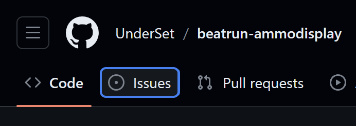

# beatrun-ammocounter
My attempt at making an ammo display that works well with Beatrun.

**No Spawnmenu options won't be added. Do not ask for it.**

## Features
- Primary ammo display, with viewpunch offset and all
- Secondary/alt-fire ammo display, with mag-style altfire support
- Support for mag-less weapons
- Fully clientside, works with any server that has `sv_allowcslua` allowed
- (Bonus (kinda):) 2D speedometer at the bottom, similar visually to some old Beatrun videos

## To be done
Just check the Issues tab, will ya?

 *No, seriously, check Issues. Please. It saves me so much time.*

## Credits
- [datæ](https://steamcommunity.com/id/75651121243836): the *original, **possibly malicious*** Beatrun gamemode
- [Arctic](https://github.com/haodongmo): some used ARC9 code for determining melee weapons
- [DyaMetR](https://github.com/DyaMetR): manual initialization script trick (see [this file in H0L-D4's source](https://github.com/DyaMetR/holohud/blob/master/lua/holohud_init.lua))
